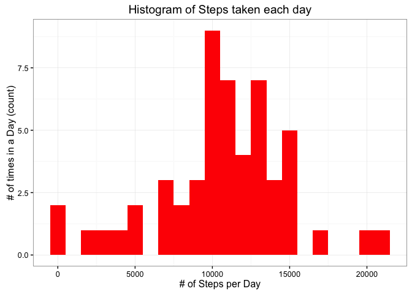
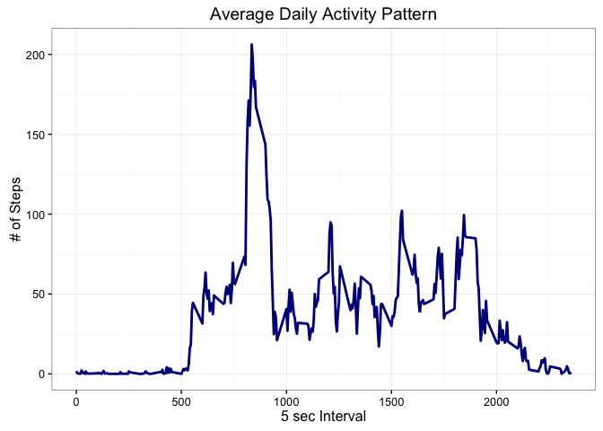

# Reproducible Research: Peer Assessment 1

#**Introduction**

This document presents the results of assginment 1 of course Reproducible Research on coursera. This project uses data from an activity monitoring device. The device collect data at 5 minute intervals through out the day. The entire dataset consists on two months data collection (Oct. to Nov., 2012)

This document presents the results using a single R markdown document processed by knitr and transformed into an HTML file.

An important consideration is the fact of our data presents as a t-student distribution (see both histograms), it means that the impact of imputing missing values with the mean has a good impact on our predictions without a significant distortion in the distribution of the data.

##*Prepare the R environment*

We will always use echo = TRUE throughout this report so that someone else will be able to read the code.
Now we set echo = TRUE as global options for this document.

```r
library(knitr)
opts_chunk$set(echo = TRUE, results = 'hold')
```

##**Loading and preprocessing the data**

This section can be splitted into two different parts:
        1. Load the data (read.csv()).
        2. Clean or tidy the data (if necessary) into a             suitable format for our analysis.
## Load the required data

```r
unzip(zipfile="activity.zip")
data <- read.csv("activity.csv", header = TRUE, sep = ",", 
                 colClasses = c("numeric", "character", "numeric"))
```

## Tidy the data

```r
data$date <- as.Date(data$date, format = "%Y - %m - %d")
data$interval <- as.factor(data$interval)
```

##**What is mean total number of steps taken per day?**

In this section we ignore the missing values.
This is the procedure used to calculate the total steps per day.

```r
library(ggplot2)
library(data.table)
steps_per_day <- aggregate(steps~date, data, sum)
colnames(steps_per_day) <- c("date", "steps")
```

- Now we make an histogram of the total number of steps taken per day, plotted with an adequate bin interval:

```r
ggplot(steps_per_day, aes(x = steps)) + 
        geom_histogram(fill = "red", binwidth = 1000) +
        labs(title = "Histogram of Steps taken each day",
             x = "# of Steps per Day", y = "# of times in a Day (count)") + theme_bw()
```

<!-- -->

- Now we calculate the mean and median of the number of steps taken per day.

```r
stepsmean <- mean(steps_per_day$steps, na.rm = TRUE)
stepsmedian <- median(steps_per_day$steps, na.rm = TRUE)
```

The mean is **10766.189** and the median is **10765**

##**What is the average daily activity pattern?**

Here we have to calculate the aggregation of steps by intervals of 5-minutes.
Converting the intervals as integers helps in the forward plotting.


```r
averages <- aggregate(data$steps, by = list(interval = data$interval),
                      FUN = mean, na.rm = TRUE)
## convert to integers
averages$interval <- as.integer(levels(averages$interval)
                                [averages$interval])
colnames(averages) <- c("interval", "av.steps")
```

- We make the time series plot of the average number of steps taken versus the 5-minutes intervals:

```r
ggplot(averages, aes(x = interval, y = av.steps)) +
        geom_line(color = "darkblue", size = 1) +
        labs(title = "Average Daily Activity Pattern", x = "5 sec Interval", 
             y = "# of Steps") + theme_bw()
```

<!-- -->

- Now we are able to find the 5-minute interval containing the maximum number of steps:

```r
max_interval <- averages [which.max(averages$steps), ]
```

The interval number **835** has maximum *206* steps.

##**Imputing missing values**

*1. Checking the number of missing values:*

The total number of missing values in our data can be checked using the following code:

```r
missing <- is.na(data$steps)
table(missing)
```

```
## missing
## FALSE  TRUE 
## 15264  2304
```
Running that code shows that the total number of missing values are **2034**.

*2. Strategy for filling in the missing values in the dataset:*

A good option is to  replace them with the mean or the median value at the same interval across days.
We have created a function na_fill(data, average) to build our new complete data frame called data_fill.


```r
na_fill <- function(data, averages) {
        na_index <- which(is.na(data$steps))
        na_replace <- unlist(lapply(na_index, FUN=function(idx){
                interval = data[idx,]$interval
                averages[averages$interval == interval,]$av.steps
        }))
        fill_steps <- data$steps
        fill_steps[na_index] <- na_replace
        fill_steps
}

data_fill <- data.frame(  
        steps = na_fill(data, averages),  
        date = data$date,  
        interval = data$interval)
str(data_fill)
```

```
## 'data.frame':	17568 obs. of  3 variables:
##  $ steps   : num  1.717 0.3396 0.1321 0.1509 0.0755 ...
##  $ date    : Date, format: "2012-10-01" "2012-10-01" ...
##  $ interval: Factor w/ 288 levels "0","5","10","15",..: 1 2 3 4 5 6 7 8 9 10 ...
```

Now we can check again the number of missing values in our new data.frame to ensure we have replace them all. Here it is another procedure which works by simply counting the number of missing values but it is also possible to use missing <- is.na(data$steps)
table(missing) 


```r
sum(is.na(data_fill$steps))
```

```
## [1] 0
```

*3. Histogram of the number of steps taken each day*
We repeat the process but now using the filled dataset, plotted with a bin interval of 1000 steps


```r
steps_fill_per_day <- aggregate(steps~date, data_fill, sum)
colnames(steps_fill_per_day) <- c("date", "steps")
ggplot(steps_fill_per_day, aes(x = steps)) + 
        geom_histogram(fill = "orange", binwidth = 1000) +
        labs(title = "Histogram of Steps taken each day",
             x = "# of Steps per Day", y = "# of times in a Day (count)") + theme_bw()
```

<!-- -->

The new values for the mean and median are calculated using the same commands


```r
steps_mean_fill   <- mean(steps_fill_per_day$steps, na.rm=TRUE)
steps_median_fill <- median(steps_fill_per_day$steps, na.rm=TRUE)
```
The mean is **10766.189** and the median is **10766.189**

**Do these values differ from the estimates from the first part of the assignment ?**

Yes, they do differ slightly.
**- Before filling the data**
        1. *Mean* : **10766.189**
        2. *Median* : **10765**
        
**- After filling the data**
        1. *Mean* : **10766.189**
        2. *Median* : **10766.189**

We see that the values after filling the data mean and median are equal

**What is the impact of imputing missing data on the estimates of the total daily number of steps ?**

As you can see, comparing with the calculations done in the first section of this document, we observe that while the mean value remains unchanged, the median value has shifted and virtual matches to the mean.
Consequently, this not affect negatively our predictions.

##**Are there differences in activity patterns between weekdays and weekends?**

We do this comparison with the table with filled-in missing values.
1. We have to augment the table with a column that indicates the date of the week.
2. Subset the table into two parts - weekdays and weekends.
3. Tabulate the average steps per interval in each subset.
4. Plot both data sets for comparison.


```r
weekdays_steps <- function(data) {
        weekdays_steps <- aggregate(data$steps, by=list(interval = data$interval),
                                    FUN=mean, na.rm=T)
        # convert to integers
        weekdays_steps$interval <- 
                as.integer(levels(weekdays_steps$interval)[weekdays_steps$interval])
        colnames(weekdays_steps) <- c("interval", "steps")
        weekdays_steps
}

data_by_weekdays <- function(data) {
        data$weekday <- 
                as.factor(weekdays(data$date)) # weekdays
        weekend_data <- subset(data, weekday %in% c("sabado","domingo"))
        weekday_data <- subset(data, !weekday %in% c("sabado","domingo"))
        
        weekend_steps <- weekdays_steps(weekend_data)
        weekday_steps <- weekdays_steps(weekday_data)
        
        weekend_steps$dayofweek <- rep("weekend", nrow(weekend_steps))
        weekday_steps$dayofweek <- rep("weekday", nrow(weekday_steps))
        
        data_by_weekdays <- rbind(weekend_steps, weekday_steps)
        data_by_weekdays$dayofweek <- as.factor(data_by_weekdays$dayofweek)
        data_by_weekdays
}

data_weekdays <- data_by_weekdays(data_fill)
```

Below you can see the plot comparing the steps taken per 5-minute interval across weekends and weekdays


```r
ggplot(data_weekdays, aes(x=interval, y=steps)) + 
        geom_line(color="gold") + 
        facet_wrap(~ dayofweek, nrow=2, ncol=1) +
        labs(x="Interval", y="Number of steps") +
        theme_bw()
```

<!-- -->

We appreciate in the comparison between both graphs that the activity on the weekday has the greatest peak from all steps intervals. However, we can see too that weekends activities have more peaks over a hundred. This might be due to the dact that activities on weekdays must follow a working routine and we find intesity activity in a little free time derived from some sport maybe. In the other hand, at weekend we can see better distribution of effort along the time.
